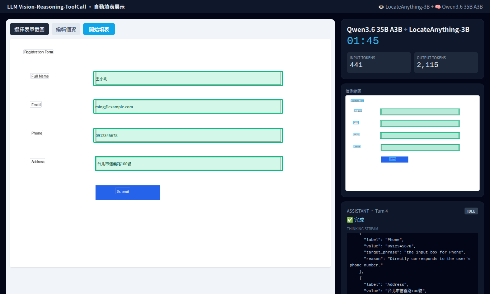
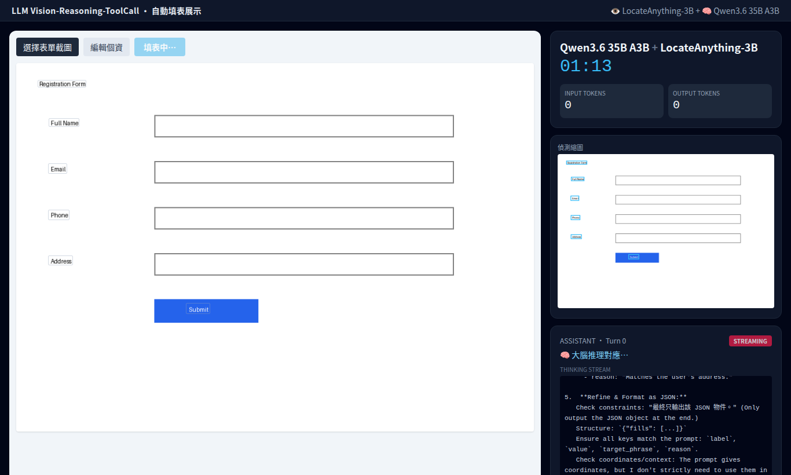

# AutoFillForm · 兩個小模型協作的自動填表系統

用**兩個小模型分工協作**，看懂網頁表單截圖並自動把使用者個資填進正確欄位——
靈感來自 [@stevibe 的展示](https://x.com/stevibe/status/2061867450413773043)
（「Two small models doing what one large model couldn't」）。



> 直播式介面（實機真實模型輸出）：左欄表單欄位被逐一定位並填入正確值，
> 右欄即時顯示計時、token 數，以及大腦 Qwen3.6 的 THINKING STREAM。
> 下圖為串流進行中（大腦推理階段）：
>
> 

## 核心理念：眼睛 + 大腦

| 模型 | 角色 | 性質 | 負責 |
|------|------|------|------|
| **NVIDIA LocateAnything-3B** | 👁 眼睛 | VLM（視覺）| 看截圖，偵測欄位標籤、做 GUI 元素**精準定位**（輸出 bounding box / point）|
| **Qwen3.6 35B A3B** | 🧠 大腦 | 純文字 MoE | 讀「眼睛轉出的表單文字地圖」+ 個資，**推理**每欄該填什麼 |

**為什麼用兩個小模型？** 一個大型 VLM 雖然能看圖也能推理，但 GUI 元素的**精準座標定位**不夠好。
LocateAnything-3B 是專精定位的小模型（ScreenSpot-Pro 上勝過一般 VLM）；
Qwen3.6 35B A3B 是 MoE，每次只激活約 3B 參數，推理快又省記憶體。
兩者分工，達成單一大模型做不到的效果。

## 資料流

```
表單截圖 ──► [眼睛 LocateAnything] 偵測文字 ──► 表單文字地圖(labels+座標)
                                                      │
個資 ───────────────────────────────────────────────►│
                                                      ▼
                                   [大腦 Qwen3.6] 推理對應 ──► 填寫計畫(label,value,定位描述)
                                                      │
                                  對每個欄位 ◄─────────┘
                                      ▼
                       [眼睛 LocateAnything] GUI 定位 ──► 精準座標(bbox/point)
                                      ▼
                       [前端疊框展示] 或 [Playwright 真實點擊+輸入]
```

## 專案結構

```
autofillform/
├── backend/          FastAPI + 兩模型協作
│   ├── app/
│   │   ├── models/locate.py   眼睛：LocateAnything-3B 包裝
│   │   ├── models/brain.py    大腦：Qwen3.6 (Ollama)
│   │   ├── pipeline.py        眼睛→大腦→眼睛 編排
│   │   ├── executor.py        選配：Playwright 真實填表
│   │   └── main.py            API
│   ├── vendor/decord-stub/    arm64 decord 空殼（僅圖片用）
│   └── tests/                 單元 + 功能 + 整合測試
├── frontend/         React + TS + Vite + Tailwind（上傳、疊框視覺化）
├── samples/          範例表單與產生腳本
└── docker-compose.yml
```

## 快速開始（DGX Spark / 本機，已驗證路徑）

需求：NVIDIA GPU、CUDA、[uv](https://docs.astral.sh/uv/)、Node.js、Ollama。

```bash
# 1) 大腦模型（Ollama）
ollama pull qwen3.6:35b

# 2) 後端依賴（含眼睛模型的 GPU 依賴）
cd backend
uv venv && uv pip install -e ".[gpu,dev]"
uv pip install -e vendor/decord-stub   # arm64 用：decord 空殼
# 眼睛模型權重會在第一次推理時自動從 HuggingFace 下載（約 7GB）

# 3) 前端
cd ../frontend && npm install

# 4) 一鍵啟動前後端
cd .. && ./run-dev.sh
# 後端 http://localhost:8000  前端 http://localhost:5173
```

### 無 GPU？用 MOCK 模式開發 / 測試

```bash
cd backend && MOCK_MODE=1 uv run uvicorn app.main:app --port 8000
```

## 對外伺服器（從別台機器連進來示範）

`start-server.sh` 會 build 前端、用**單一埠**同時提供網頁與 API，並綁 `0.0.0.0`、
脫離終端機常駐（關掉 SSH 也不會停）：

```bash
./start-server.sh           # 預設 8000，真實模型
MOCK_MODE=1 ./start-server.sh   # 無 GPU 先看前端
./stop-server.sh            # 停止
```

啟動後會印出區網網址，例如 `http://192.168.1.112:8000`。在**另一台機器**的瀏覽器打開，
即可上傳表單（**圖片或 PDF**）→ 按「開始填表」→ 觀看即時展示。
（若連不到，請確認防火牆放行該埠：`sudo ufw allow 8000`。）

> 支援 PDF：上傳後後端以 PyMuPDF 取第一頁轉點陣圖，前端顯示的即為模型實際處理的影像，
> 確保疊框座標精準對齊。

## API

| 方法 | 路徑 | 說明 |
|------|------|------|
| GET | `/api/health` | 健康檢查、目前使用的模型 |
| POST | `/api/autofill` | `multipart`：`image`(截圖) + `profile`(個資 JSON 字串) → 一次回傳填寫計畫 |
| POST | `/api/autofill/stream` | 同上，但以 **SSE 逐步驟串流**整個過程（眼睛掃描→大腦思考→逐欄定位→填入），供前端直播展示 |

### 直播式展示

前端上傳表單截圖、按「**開始填表**」後，會即時演出整個流程：

- **左欄**：表單上的欄位被逐一藍色高亮定位，接著綠框 + 打字機把值填進去
- **右欄**：模型名稱、經過時間、即時 INPUT/OUTPUT token 數、偵測縮圖，以及
  **THINKING STREAM**——直接串流大腦 Qwen3.6 的即時推理過程

範例：

```bash
curl -s http://localhost:8000/api/autofill \
  -F image=@samples/form.png \
  -F 'profile={"name":"王小明","email":"ming@example.com","phone":"0912345678"}'
```

## 測試

```bash
cd backend
MOCK_MODE=1 uv run pytest -q                 # 單元 + 功能（無需 GPU）
RUN_GPU_TESTS=1 uv run pytest -q             # 加上真實兩模型整合測試（需 GPU + Ollama）
```

實測：眼睛載入約 60s；單次定位約 2–3s；完整 4 欄表單端到端約 80s（首次含模型載入）。

## 選配：真實自動填表（Playwright）

`app/executor.py` 可把座標換算成實際頁面點擊+輸入：

```bash
cd backend && uv pip install -e ".[exec]" && uv run playwright install chromium
```

## Docker 部署

`docker-compose.yml` 提供部署參考（大腦走宿主機 Ollama、眼睛在 GPU 容器）。
DGX Spark（arm64 + CUDA13）上已驗證可用的是上面的本機 uv 路徑；容器映像的
CUDA base 請對應你的環境。

```bash
docker compose up --build          # 前端 http://localhost:9080
MOCK_MODE=1 docker compose up       # 無 GPU 先看前端
```

## 授權與限制

- 本專案程式碼：MIT。
- **NVIDIA LocateAnything-3B：NVIDIA 研究授權，僅限學術 / 非商業用途**，請勿用於商業情境。
- Qwen3.6：依其模型授權。

## 模型出處

- [NVIDIA LocateAnything-3B](https://huggingface.co/nvidia/LocateAnything-3B) ·
  [論文](https://arxiv.org/abs/2605.27365)
- [Qwen3 系列](https://github.com/QwenLM/Qwen3-VL)（本機以 Ollama `qwen3.6:35b` 提供）
